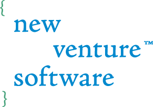

For more information read our blog post: [Pixel density and Resolution tool for CSS media queries](https://www.newventuresoftware.com/blog/pixel-density-and-resolution-tool-for-css-media-queries?utm_source=github&utm_medium=pixel-density-tool&utm_campaign=public_projects_and_samples)

# Install and Build
```
npm install
npm run build
```

## Our Company

[](https://www.newventuresoftware.com?utm_source=github&utm_medium=pixel-density-tool&utm_campaign=public_projects_and_samples)

Do you need assistance on your project? Drop us a line at [www.newventuresoftware.com/contact](https://www.newventuresoftware.com/contact?utm_source=github&utm_medium=pixel-density-tool&utm_campaign=public_projects_and_samples).
New Venture Software is an expert software consulting, custom software and user experience development company. Defined by its passion for building software the right way, New Venture Software delivers amazing software experiences through technological innovation, thoughtful user experience design and flawlessly built software solutions.